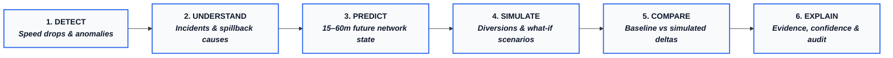
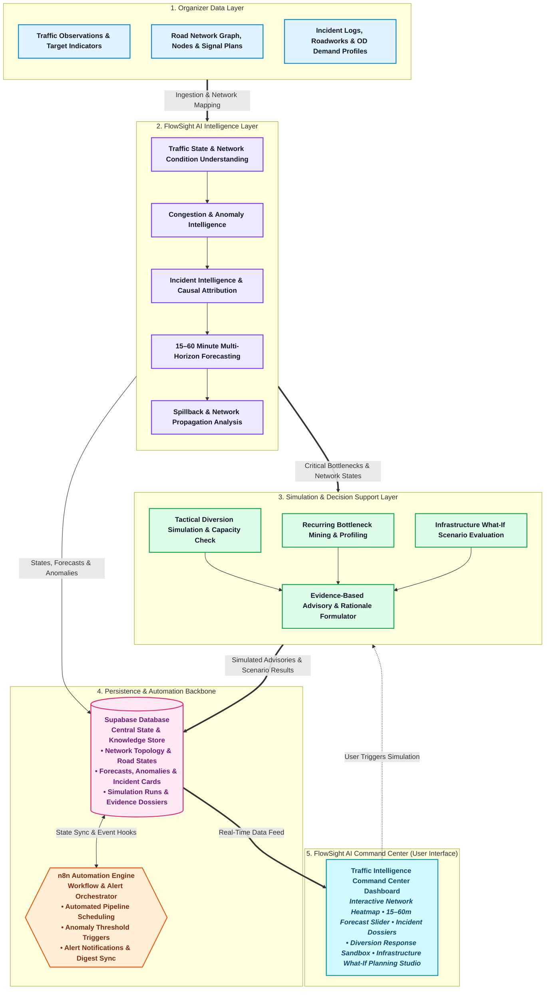

# FlowSight AI — Urban Traffic Flow & Incident Intelligence Platform

---

# 1. Problem Understanding

### The Urban Traffic Challenge
In modern metropolitan areas, urban road networks operate under continuous strain. Traffic conditions do not remain static; they evolve rapidly and unpredictably throughout the day. A corridor moving smoothly at one moment can plunge into gridlock minutes later due to:
* **Asymmetric Peak-Hour Demand:** Sudden morning and evening surges where vehicle volume exceeds the physical throughput of major arterial corridors and flyovers.
* **Signalized Intersections and Platoon Delays:** Periodic traffic signal cycles that repeatedly compress vehicles into dense platoons, creating recurring friction points.
* **Abnormal Traffic Events and Incidents:** Vehicle breakdowns, minor collisions, road debris, and unexpected lane closures that suddenly strip roadways of their carrying capacity.
* **Maintenance and Roadworks:** Planned or semi-permanent construction zones that force abrupt lane merges and throttle downstream capacity.
* **Cascading Queue Spillback:** When a queue on one road segment grows beyond its physical length, it spills backward into upstream intersections. This physically blocks cross-street traffic and triggers cascading gridlock across neighboring corridors that would otherwise be free-flowing.

### Why Simply Knowing a Road is Congested is Not Enough
Conventional traffic monitoring tools only report that a road is currently "red" or delayed. For traffic managers, urban planners, and transit operators, this simple notification is inadequate and arrives too late. 

To manage urban mobility proactively, decision-makers need an intelligence system that answers five fundamental questions:
1. **What is happening?** What is the true traffic state across all connected corridors right now?
2. **Why is it happening?** Is the congestion caused by an accident, an authorized roadwork, sheer peak volume, or queue spillback from a downstream junction?
3. **What will happen next?** How will queues spread over the next 15, 30, 45, and 60 minutes if no action is taken?
4. **What operational action can be simulated?** Can diverting a portion of approaching traffic onto alternate corridors alleviate the choke point, or will it merely overload adjacent neighborhood streets?
5. **What long-term network changes could fix recurring bottlenecks?** Which locations fail repeatedly, and how would adding a lane, changing a turn pocket, or modifying a turn restriction improve network delay?

### Project Purpose & Operating Boundaries
**FlowSight AI** is built specifically to address this challenge. Using the **organizer-provided traffic observations and road-network datasets**, the application constructs a continuously updated software-based representation of the urban road network. It serves as an AI-powered traffic intelligence, forecasting, and decision-support simulation platform.

> [!IMPORTANT]
> **System Boundaries & Operating Constraints:**
> * **Software-Only & Advisory:** FlowSight AI is strictly a **decision-support and simulation platform**. All generated rerouting plans and infrastructure evaluations are advisory simulations for human review.
> * **No Real-World Actuation:** The application does **not** directly control municipal traffic signals or signal timings.
> * **No Real-World Surveillance or Tracking:** The application does **not** access live municipal CCTV cameras, intercept vehicle GPS devices, or tap roadside physical sensors.
> * **No Construction Execution:** Long-term infrastructure simulations are analytical what-if evaluations for urban planners, **not** real-world construction authorizations or engineering blueprints.

---

# 2. How the Application Works

When a traffic operator, urban planner, or hackathon reviewer opens FlowSight AI, the platform delivers an intuitive, end-to-end operational experience designed to turn raw traffic data into clear situational awareness and simulated action.

### 2.1 Traffic Command Center
Upon launching the application, the user is presented with the **Traffic Command Center**—a unified operational interface displaying:
* **Interactive Network Map:** A complete topological view of the urban road network with directed road segments color-coded by current operational health.
* **Current Traffic Conditions:** Instantaneous velocity, estimated travel times, and road service levels across every arterial link.
* **Configurable Congestion Regimes:** Roads categorized cleanly into operational states: *Free-Flow*, *Building*, *Congested*, *Severe*, or *Unknown / Low Confidence*.
* **Live System Alerts:** A prioritized notification panel highlighting active anomalies and high-risk corridors.
* **Data Freshness & Quality Confidence:** Clear badges indicating observation currency, data completeness, and overall tracking confidence for every segment.
* **Replay / Current Timestamp Controls:** An interactive time controller allowing users to step through live streaming batches or replay historical traffic days minute by minute.

### 2.2 Traffic Intelligence
FlowSight AI continuously analyzes traffic flow behavior to distinguish normal everyday congestion from abnormal operational conditions:
* **Baseline vs. Anomaly Detection:** The system compares current segment speeds and travel times against time-of-day and day-of-week historical baselines. Normal morning peak congestion is recognized as expected, while sudden midday speed drops are immediately flagged as abnormal.
* **Evidence-Backed Alerts:** When an alert is raised, the application never shows an unexplained warning. Clicking any flagged road segment opens an **Evidence Dossier** detailing the speed drop magnitude, the baseline historical speed, the duration of the condition, and neighboring link behavior.

### 2.3 Traffic Forecasting
The application provides an interactive **Forecast Slider** that allows users to peer into the future:
* **Rolling Time Horizons:** Operators can toggle between **15-minute, 30-minute, 45-minute, and 60-minute** projections.
* **Operational Meaning:** 
  * *15 Minutes:* Identifies immediate shockwave risks and approaching platoon bottlenecks.
  * *30 Minutes:* Highlights the critical operational window to evaluate diversions before upstream junctions lock up.
  * *45 to 60 Minutes:* Reveals whether a congested corridor will naturally recover or experience cascading spillback into the wider network grid.

### 2.4 Incident Intelligence
When abnormal traffic behavior occurs, FlowSight AI correlates the kinematic slowdown with available context data:
* **Contextual Correlation:** The application cross-references detected anomalies against organizer incident reports and authorized roadwork schedules.
* **Responsible Attribution:** If an anomaly spatially aligns with a documented roadwork permit, it is clearly presented as a *Confirmed Roadwork Bottleneck*. If it matches a recorded vehicle collision, it is presented with verified incident attributes.
* **The "Incident-Like Anomaly" Protocol:** If the available dataset contains no record explaining a severe slowdown, the application strictly labels it an **"Incident-Like Anomaly"**. FlowSight AI never invents or guesses a physical accident cause without verified data evidence.

### 2.5 Spillback & Network Impact
Congestion rarely stays confined to the segment where it starts. FlowSight AI helps operators visualize network-wide propagation:
* **Queue Growth Tracking:** The map visualizes queue accumulation as segment vehicle storage reaches capacity.
* **Upstream Blockage Warnings:** The application traces connected upstream feeder links and flags intersections where backed-up queues threaten to block lateral cross-street traffic, warning operators of imminent gridlock cascades.

### 2.6 Diversion Simulation
When severe congestion or an incident-like anomaly threatens a corridor, the user can test tactical responses in the **Response Sandbox**:
1. **Initiate Simulation:** The user selects a congested link or responds to an automated spillback alert.
2. **Alternative Corridor Identification:** The system automatically discovers valid alternate topological paths that bypass the choke point while respecting turn restrictions.
3. **Interactive Diversion Testing:** The user adjusts a slider to test diverting different fractions of approaching traffic (e.g., 10%, 20%, or 30%).
4. **Before vs. After Comparison:** The application renders a side-by-side comparison showing predicted delay on the primary corridor versus added load on bypass roads.
5. **Secondary Overload Safeguard:** The simulation checks whether diversion routes have sufficient spare capacity. If rerouting would choke secondary neighborhood streets, the system explicitly warns the user rather than recommending a flawed diversion.
6. **Purely Advisory Output:** The resulting recommendation is clearly delivered as an advisory guidance package for human review, never as an automated real-world command.

### 2.7 Bottleneck Intelligence
For long-term mobility analysts, FlowSight AI mines historical observation patterns to identify chronic structural friction:
* **Recurrence Profiling:** Highlights locations that repeatedly break down under identical recurring conditions.
* **Actionable Metrics:** Reveals how frequently a bottleneck occurs (recurrence rate), how long queues persist (duration), how many vehicle-hours of delay it creates, and whether its queues frequently trigger upstream intersection spillback.
* **Separating Chronic from Episodic:** Distinguishes structural bottlenecks (caused by lane drops or poor geometry) from episodic delays (caused by random collisions or bad weather).

### 2.8 Infrastructure / Network What-If Simulation
Urban planners can test hypothetical network modifications before committing capital resources. Supported scenarios include:
* **Adding Capacity / Lanes:** Testing the impact of expanding link width.
* **Modified Turn Movements & Dedicated Pockets:** Evaluating dedicated turn bays to prevent turning vehicles from blocking through-traffic.
* **Lane Allocation Changes:** Simulating dedicated transit or turning lanes.
* **Turn Restriction Adjustments:** Testing the impact of prohibiting problematic intersection turns.
* **Hypothetical Connector Links:** Simulating the addition of a new connecting road.

The application delivers a comprehensive **Before vs. After Comparison**, evaluating total network travel time, corridor delay, queue dissipation times, and spillback reduction. All simulations remain high-level planning analytics, not construction blueprints.

### 2.9 Explainability and Confidence
Every alert, forecast, and advisory generated by FlowSight AI is accompanied by clear operational context:
* **Supporting Evidence:** Clear charts showing observed speeds, historical expectations, and volume trends.
* **Data Quality & Confidence:** Visual indicators reflecting underlying data completeness and observation regularity.
* **Documented Assumptions:** Clear statements of simulation parameters, diversion percentages, and capacity bounds.

---

### The Complete FlowSight AI Operational Loop

$$\mathbf{Detect} \;\longrightarrow\; \mathbf{Understand} \;\longrightarrow\; \mathbf{Predict} \;\longrightarrow\; \mathbf{Simulate} \;\longrightarrow\; \mathbf{Compare} \;\longrightarrow\; \mathbf{Explain}$$

---

# 3. Application Architecture

This section describes the high-level architecture of the **finished FlowSight AI application**, illustrating how its user-facing components, analytical engines, data stores, and automation services interact.

### 3.1 Application Interaction Diagram

---

### 3.2 Application Component Breakdown

### Data Layer
The **Data Layer** serves as the empirical foundation of the application. It ingests and normalizes the organizer-provided traffic observations, network topology definitions, signal plans, turn restrictions, incident logs, roadwork notices, and origin-destination demand profiles. It validates data integrity, handles missing values, and attaches traffic observations directly to the road segments in the network digital twin.

### Intelligence Layer
The **Intelligence Layer** transforms raw observations into meaningful situational awareness. It estimates current segment speeds, travel times, and capacity utilization, categorizing roads into operational congestion regimes. It analyzes statistical deviations against historical baselines to detect abnormal kinematic shockwaves, traces how queues propagate to neighboring roads, and attributes slowdown causes using available context logs.

### Forecasting Layer
The **Forecasting Layer** provides predictive foresight across four distinct planning horizons: **15, 30, 45, and 60 minutes**. It projects how current speeds and queue lengths will evolve over time, giving traffic managers an operational decision window to act before localized queues spill backward into gridlock.

### Simulation Layer
The **Simulation Layer** acts as a risk-free virtual sandbox for decision-makers. It models tactical flow diversions across alternative corridors, checking whether secondary roads have the spare capacity to absorb rerouted traffic. For long-term planning, it simulates hypothetical infrastructure modifications (adding lanes, turn pockets, or new connectors) under identical demand loads, providing clear before-and-after performance metrics.

### Decision Support Layer
The **Decision Support Layer** synthesizes the outputs of the intelligence and simulation engines into actionable, evidence-based advisories. Rather than issuing black-box recommendations, it compiles a complete audit dossier for every suggested intervention, detailing supporting traffic indicators, expected delay savings, confidence scores, and documented assumptions.

### Application Layer (Frontend Command Center)
The **Application Layer** is the primary visual environment where users interact with FlowSight AI. Built as a command-center interface, it presents the interactive road network map, live anomaly cards, the multi-horizon forecast timeline slider, the interactive diversion sandbox, and the infrastructure planning studio in a unified, responsive workspace.

### Automation Layer (n8n Orchestration)
The **Automation Layer**, powered by n8n, coordinates event-driven workflows across the system. It is **not** an AI model itself; rather, it acts as the application's operational orchestrator. It listens for new observation batches or replay ticks, schedules periodic forecasting routines, monitors anomaly severity thresholds, triggers automated diversion simulations when chokepoints form, and synchronizes alerts to the user dashboard.

### Database Layer (Supabase / PostgreSQL)
The **Database Layer**, hosted on Supabase, provides persistent relational storage for the application. It maintains the single source of truth for the road network graph, historical baseline profiles, real-time segment observations, generated 15–60 minute forecasts, detected incident records, what-if simulation results, and active operational advisories.
